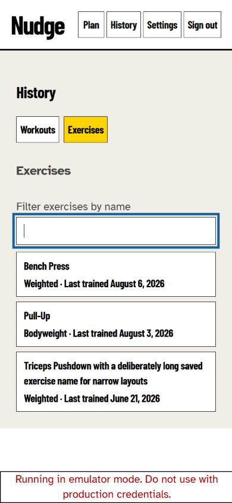
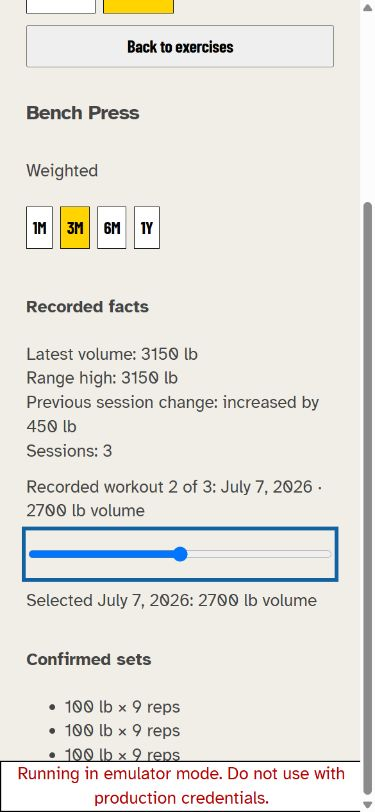
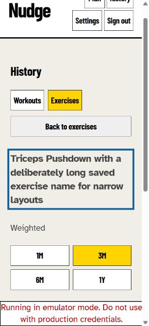
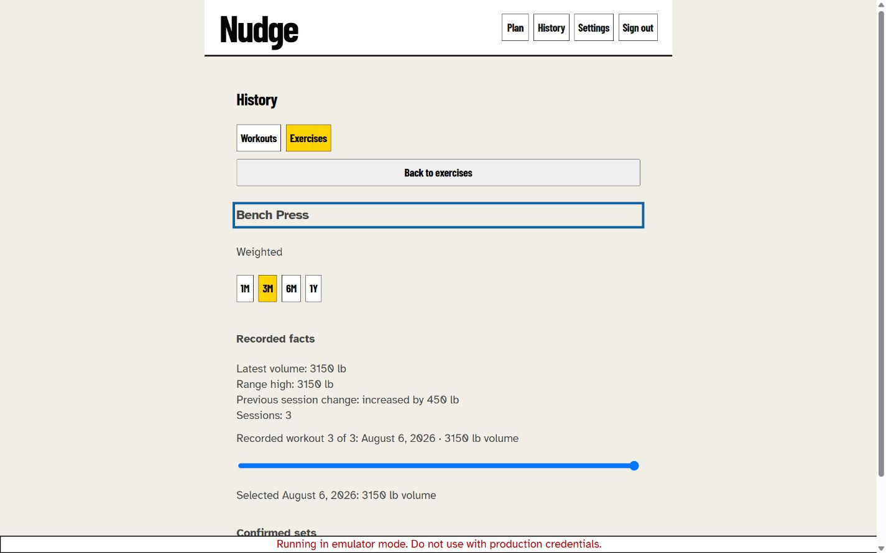

# TREK-312 rendered UX evidence

Date: 2026-08-10

Build: `codex/epic-17-workout-trends` through the final Signal Trace chart-clarity and outcome-review delta

Surface: authenticated private-access lease with the synthetic `workout-trends` scenario, reference date 2026-08-10

## Rendered journeys

| Scenario | Viewport | Observed result |
| --- | --- | --- |
| Workouts continuity | 390 x 844 | History opens on Workouts with the existing chronological workout cards and view heading focus. |
| Discovery and filter | 390 x 844 | Exercises moves focus to the filter after one complete discovery read. Bench Press, Pull-Up, and the long Triceps identity are ordered by last trained date. A non-matching filter shows the neutral no-match state, and clearing it restores the list. |
| Weighted evidence | 390 x 844 | Bench Press defaults to 3M and shows `Workout volume (lb)` across the complete May 10–August 10 window, three irregular real workout dates, rounded 2000–3500 lb grid labels, an explicit selected-workout date, range-wide latest/high/session facts, and confirmed sets. The compact comparison follows the selected workout: July 7 shows `Since May 27: +420 lb volume`, August 6 shows `Since July 7: +450 lb volume`, and May 27 omits the comparison because no earlier recorded workout exists. |
| Bodyweight evidence | 390 x 844 | Pull-Up keeps Full, Assisted, and Eccentric totals separate in the summary, selected-workout label, confirmed sets, and a shared-scale `Reps by type` plot distinguished by labelled line/marker swatches rather than color alone. Independent highest values are each labelled `Highest ... reps in one workout`, so values from different sessions are not presented as one composite best workout. |
| Sparse and empty range | 390 x 844 | The long Triceps identity shows one-record copy in 3M. Selecting 1M removes all prior facts/evidence and focuses `No recorded workouts in this range.` |
| Narrow reflow | 320 x 700 | The long exercise name wraps in the detail heading, range controls form a 2-by-2 grid, and the reading/focus order remains intact without clipped trend content. |
| Desktop | 1440 x 900 | The same semantic order is preserved; the native scrubber expands with the content column and confirmed evidence remains below it. |
| Active workout recovery | 1440 x 900 | After planning and starting a workout, opening History shows Workouts without replacing the active session. Returning through the Workout navigation resumes the same Warmup state and elapsed timer. |

The native numeric/date scrubber remains the canonical interactive control and accessibility fallback. A dependency-free, `aria-hidden` inline SVG supplements it with the approved Signal Trace. Signal yellow identifies pressed view/range controls and the currently selected plot markers; the unexplained full-height selection rail was removed. The feature adds no authored motion, so reduced-motion users receive immediate state updates without delayed evidence.

## Signal Trace additive evidence

| Scenario | Viewport | Observed result |
| --- | --- | --- |
| Goal-first weighted journey | 390 x 844 | A fresh blind reviewer entered History, found Bench Press, understood the 3M time/value direction, moved to July 7 with ArrowLeft, and observed the yellow selected marker, explicit selected-workout date, ordinal/value, and confirmed sets update together. |
| Narrow Signal Trace reflow | 320 x 844 | The final plot, legend, range labels, slider, and evidence stayed within a 320px viewport with no horizontal scroll (`305px` document body within `320px`). |
| Calendar-window truthfulness | Live seeded build | Bench Press 3M labelled the full May 10–August 10 selected window. Its May 27, July 7, and August 6 points were inset at proportional x positions rather than stretched to the plot edges. |
| Pointer synchronization | Live seeded build | Selecting the first plotted Bench Press point moved the yellow selected marker and the canonical slider to workout 1, and updated the selected evidence to May 27 and 2280 lb. |
| Bodyweight series | 390 x 844 | Pull-Up rendered Full, Assisted, and Eccentric on one labelled scale with distinct line patterns and marker shapes; selected text and confirmed sets remained factual and synchronized. |

The additive blind journey review was READY with no direct defects. It did not use a physical touch device or screen reader and did not instrument contrast or 200-percent zoom; native slider semantics, keyboard operation, visible focus, pressed states, and 320/390px reflow were exercised live.

## Outcome-based usefulness review

A fresh blind reviewer first chose two trainee questions without being told which exercise or chart interaction to use: whether Bench Press meaningfully improved over the last three months, and whether Pull-Ups moved toward more unassisted work. The reviewer found the feature genuinely useful for those narrow recorded-performance questions. Bench Press evidence supported a moderate-high-confidence conclusion because recorded volume rose from 2280 to 3150 lb while both load and repetitions increased. Pull-Up evidence supported a moderate-confidence conclusion that full-rep work increased from 9 to 18, while the varying assisted/eccentric mix prevented a broader claim about strength or assistance need.

The first outcome pass found that the compact bodyweight `Range high` combined per-series maxima from different workouts and could be mistaken for a best session that never occurred. The corrected live build presents three independent facts: `Highest full reps in one workout`, `Highest assisted reps in one workout`, and `Highest eccentric reps in one workout`. A focused fresh-tab recheck at 390 x 844 marked that finding closed and the outcome journey READY.

## Baseline captures

These captures document the pre-Signal Trace TREK-312 baseline and are retained for Workouts continuity, list, long-name, and responsive provenance. They are not evidence of the final SVG visualization; the final Signal Trace evidence is recorded in the live observations above.

## Async and recovery evidence

The healthy seeded lease directly exercised successful discovery/detail reads and user-initiated range replacement. Focused component tests provide deterministic coverage for pending loading states, whole-request discovery and detail errors, Retry focus retention and recovery, stale-response rejection, unmount/view replacement, empty discovery, filtered-empty state, back-to-row/filter focus, and removal of prior results during range replacement. These states were not fabricated in the rendered build by disrupting the shared emulator.

## Verification

- Signal Trace range/plot delta: the combined `WorkoutHistory` and storage replay passed 59 tests.
- Final one-shot focus remediation: `npm test -- --run src/tests/WorkoutHistory.test.jsx` passed 40 tests, including slider focus retention after a range replacement.
- Final combined replay: `npm test -- --run src/tests/WorkoutHistory.test.jsx src/tests/storage.test.js` passed 60 tests.
- Touched lint, production build, and `git diff --check` passed after the final focus correction.
- Final chart-clarity and truthfulness delta: `npm test -- --run src/tests/WorkoutHistory.test.jsx` passed 41 tests; touched lint, production build, and `git diff --check` passed.
- Selected-workout comparison correction: `npm test -- --run src/tests/WorkoutHistory.test.jsx` passed 42 tests; touched lint, production build, and `git diff --check` passed. Live seeded verification covered weighted middle/first/latest selections and a bodyweight middle selection.

- `npm test -- --run src/tests/storage.test.js src/tests/trendProjection.test.js src/tests/WorkoutHistory.test.jsx src/tests/App.lazyNavigation.test.jsx src/tests/emulatorScenarios.test.js` — 93 passed, including the mixed date-only/ISO visible-calendar ordering regression.
- Touched-file lint — passed.
- Production build — passed after the final production-code correction.
- `git diff --check` — passed.
