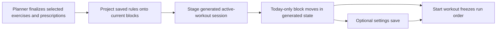

# Contextual Exercise Run Ordering

## Status

Discovery candidate approved on 2026-08-03. This document is the planning and UX
artifact for TREK-294. Implementation is not authorized until the required reviews
and user approval are recorded. The user approved a 50-rule limit with least-recently-
used eviction on 2026-08-03.

Planning gates: UX design READY, architecture READY, and senior implementation-plan
review READY. Implementation remains pending explicit user authorization.

## Problem

The planner owns exercise selection but also fixes the order in which selected work
is presented. A trainee may consistently prefer Dips before Tricep Extensions, yet
must currently accept the planner order every time. A single global ranking cannot
express valid contextual preferences such as:

```text
Push-ups + Pull-ups:             Push-ups -> Pull-ups
Push-ups + Pull-ups + Sit-ups:   Pull-ups -> Sit-ups -> Push-ups
```

## Goals

- Let a trainee change only the run order of a generated workout before starting.
- Make a change apply to today only unless the trainee explicitly saves it.
- Reuse a saved order when all exercises from that saved context appear again.
- Preserve useful preferences when unrelated exercises or superset members are added.
- Resolve overlapping saved preferences deterministically without routine conflict UI.
- Keep supersets as indivisible movable blocks.

## Non-goals

- No change to selection, prescriptions, sets, time fitting, recovery, rotation,
  diversity, or completed-workout order.
- No drag and drop or reordering after **Start workout**.
- No today-only superset-member ordering; member order remains in Superset settings.
- No global ranking, pairwise score, persisted graph, rule weights, or history inference.
- No per-rule preference manager, migration, backfill, Firebase rules change, or new
  service. Settings only needs a clear-all recovery action.

## User Experience Contract

### Pre-start hierarchy

At the 390 x 844 reference viewport, generated work is shown as compact collapsed
blocks so several rows and the primary action remain understandable. **Start
workout** remains the only signal-yellow action. Each block has neutral **Move
earlier** and **Move later** buttons; unavailable boundary moves are disabled.

```text
Plan ready                                      Preferred order applied

1  Dips                              [Later]
2  Superset · Pull / Plank / Sit  [Earlier] [Later]
   Moves together; change member order in Settings › Supersets.
3  Tricep Extensions                 [Earlier]

Your changes are for this workout only unless you save them.
                                      [Start workout]

When all of these exercises appear again, Nudge keeps the order of their
exercise and superset blocks. Superset member order still comes from Settings ›
Supersets. Other blocks may appear between them.
                         [Use this order in future workouts]
```

The future-order action is secondary and appears only after the user has changed the
current block order. Returning to the initially displayed order removes the dirty
state. **Start workout** immediately follows the ordered blocks in DOM and visual
order; the future-save helper and action follow it as subordinate alternatives. The
today-only notice appears only while the order is dirty and is independent of the
passive **Preferred order applied** status. Merely generating or viewing a workout
never creates a preference, including when a new fourth exercise appears.

### Today-only move

Moving a block immediately updates the generated session in memory. It writes no
settings and does not change the block's exercise prescription. Focus stays on the
moved block's corresponding move control when available, or the block itself when
the same control becomes unavailable. One polite atomic live region announces:

> Pull moved to position 2 of 5. This change is for this workout only.

The updated order is the order that starts, recovers, and is eventually saved as the
completed workout. Moves are rejected once the workout starts.

### Saving for future workouts

After a move, the secondary action is **Use this order in future workouts**. Helper
copy states:

> When all of these exercises appear again, Nudge keeps the order of their exercise
> and superset blocks. Superset member order still comes from Settings › Supersets.
> Other blocks may appear between them.

Saving writes the current ordered blocks as one context-aware rule. While that
single save attempt is pending, move controls, the save action, and **Start workout**
are disabled so the action has one unambiguous outcome. No workout-recovery record is
written by preference saving.

The initiating button remains mounted and focused. During the attempt it reads
**Saving order…**, is disabled, and is described by the adjacent visible status
**Saving this order for future workouts.** No spinner-only state is allowed.

If the Firestore write has not settled after 15 seconds, **Start workout** is
re-enabled and focus remains on the mounted save control. Because the write cannot be
canceled, the state remains indeterminate/background-pending: move and save controls
stay disabled, no retry is offered, and non-alert copy says:

> Saving is taking longer than expected. You can start your workout; we'll confirm
> when it finishes.

Starting never awaits that background write. Its eventual success or definitive
rejection uses the same terminal handling below, even if the user started the workout
or visited Settings in the meantime.

Success is announced politely:

> Order saved. It will be used when all of these exercises appear again.

Success makes the captured order the new comparison baseline. If the pre-start
ordering section is still present, it retires the dirty notice and future-save action
and leaves focus on the stable section status. A later move compares against that
saved baseline and reveals the future-save action again. If the transaction evicted
the least recently used rule at the approved retention limit, identify that context
in visible confirmation:

> To keep up to 50 saved orders, Nudge replaced the saved order for Push-ups,
> Pull-ups, and Sit-ups.

When the saved context overrides a less-specific rule, visible confirmation explains
the scope without asking the user to resolve a conflict:

> Order saved. When Push-ups, Pull-ups, and Sit-ups all appear, this order takes
> priority over your saved Push-ups-before-Pull-ups order. Push-ups before Pull-ups
> still applies without Sit-ups.

A definitively rejected save preserves today's order and shows adjacent
`role="alert"` feedback plus **Try again**:

> Couldn't save this order for future workouts. This workout's order is unchanged.

Definitive failure preserves the dirty baseline, replaces the mounted action with
**Try again**, and keeps focus on that action when the pre-start ordering section is
still present. The 15-second indeterminate state is not failure. Starting is
available after a definitive failure and remains available once the indeterminate
gate has elapsed.

The ordering baseline, captured save candidate, single-flight operation, 15-second
gate, and eventual outcome belong to the existing App/session lifetime above lazy
destinations, so a Settings detour cannot erase or duplicate a pending operation. A
retry always resubmits the captured failed candidate rather than deriving a new
order.

While the pre-start ordering section exists, it owns the visible preference-save
state. After Start, Workout renders the same state in a compact **Order preference**
panel immediately after the current focused set or phase's dominant action region,
never between its heading and primary action. Settings renders that panel immediately
below its heading whenever an operation or unretired outcome exists. The panel shows:

- pending or indeterminate copy as a non-alert status with no action;
- success, including any eviction disclosure, with a **Dismiss** button;
- definitive failure as an alert with **Try again**, which resubmits the captured
  order rather than any current screen order.

A late success or eviction updates the panel and polite atomic announcement but never
moves focus. A definitive failure uses only the panel's alert and is not also sent to
the polite live region. If the initiating pre-start control no longer exists, focus
remains wherever the user is working. Dismiss retires only terminal success feedback;
failure remains until retry succeeds or clear-all succeeds. Starting or changing
destinations never cancels the operation.

While a save is pending or indeterminate, Settings disables **Clear saved exercise
order preferences** and shows adjacent text: **Wait for the current order save to
finish before clearing saved orders.** After a definitive failure, clear-all is
available; a successful clear retires the failed captured candidate and its retry.
Save and clear are therefore never concurrent within the current App instance.

### Applied preference

When one or more saved rules affect the generated order, show passive text
**Preferred order applied**. Do not move focus, open a prompt, or announce routine
generation. Existing planner order remains the fallback for blocks not constrained
by an accepted saved rule.

### Clear-all recovery

Settings includes one secondary/destructive-confirmed action: **Clear saved exercise
order preferences**. Confirmation explains that future workouts return to planner
order and today's already generated workout is unchanged. Success clears the stored
rule array. Failure retains it and offers retry. A full rule manager is deferred
until real usage demonstrates a need.

### Narrow-width and accessibility requirements

- At 320px, move controls wrap below the label with no horizontal scrolling,
  clipped focus indicator, or overlap.
- Interactive targets are at least 44 x 44 CSS pixels.
- DOM order matches visual block order.
- Position and move availability are conveyed in accessible names, not color alone.
- The superset row names every current member and says it moves together.
- Move and save announcements share one polite atomic live region; only actionable
  failure uses an alert.
- Disabled controls remain visibly distinguishable and are not the sole explanation
  of a pending save.

## Preference Data Contract

Store the smallest sufficient representation in the existing user settings document:

```js
preferredOrderRules: [
  {
    blocks: [
      { exerciseIds: ['pull-up'] },
      { exerciseIds: ['sit-up'] },
      { exerciseIds: ['push-up'] },
    ],
  },
],
preferredOrderRuleUsage: [
  '["pull-up","push-up","sit-up"]',
],
```

The rule array is newest-saved first and supplies the equal-specificity recency
tie-break. Do not add IDs, timestamps, edges, weights, counters, or history. Each
Firestore-safe block map contains only an `exerciseIds` array of stable catalog IDs;
a superset block stores its member IDs in current member order. Nested arrays are not
valid Firestore values and must not be used. A context key is the JSON representation
of that rule's lexicographically sorted unique exercise IDs.
`preferredOrderRuleUsage` stores those keys most-recently-used first and remains
separate from saved-rule precedence.

Retain at most 50 unique contexts. Saving a new or replacement rule makes that
context most recently used. A successful Start also refreshes an accepted rule only
when the final displayed block order still honors all of its projected constraints.
Generation alone, an atomically skipped rule, and a rule contradicted by a today-only
move do not count as use. Saving the 51st unique context evicts the least recently
used context. Rejecting the save is not proposed because clear-all is the only
recovery UI.

Normalization keeps only well-formed rules:

- `blocks` is an array containing at least two maps whose only field is a non-empty
  `exerciseIds` array;
- every exercise ID is a non-empty string and occurs once in the rule;
- duplicate contexts are removed by their unordered union of exercise IDs, keeping
  the newest occurrence;
- saving the same exact context replaces the older rule and moves it to the front;
- usage keys are unique, refer only to valid retained contexts, and remain separate
  from the rule array's save-recency order;
- valid rule contexts missing from the usage array are appended in rule-array order,
  providing a deterministic least-recently-used fallback;
- after deduplication and usage normalization, only the 50 most recently used valid
  contexts remain;
- malformed rules are ignored without blocking settings or workout generation.

Saving a rule uses one Firestore transaction that reads the current settings field,
normalizes both arrays, replaces/prepends the candidate in `preferredOrderRules`,
makes its context key most recently used, and applies the cap by removing both the
final usage key and its matching rule. It updates only the two preference fields and
returns the evicted context for the success disclosure. Do not save from the settings
snapshot used for generation.
Clear-all uses the same preference-operation owner and transaction to clear both
fields so cross-tab saves do not silently overwrite unrelated saved contexts.
Concurrent save and clear operations retain normal last-committed transaction
semantics.

The resolver returns ephemeral context keys and fingerprints for rules it accepted.
The fingerprint is deterministic `JSON.stringify` output of the normalized ordered
block maps; do not add hashing or a dependency. Neither value is added to the
generated or saved workout schema.
After Start successfully acquires and persists the displayed workout, compare those
accepted rules with the final displayed blocks. In one best-effort background
transaction, move only still-honored contexts whose current stored fingerprints match
the generation snapshot to the front of `preferredOrderRuleUsage`, preserving their
prior relative usage order. A concurrently replaced rule with the same context is not
credited. If the normalized usage order is already unchanged, do not write. This
bookkeeping never delays or fails Start; a failed touch remains stale and can be
retried naturally the next time that rule is honored.

Without timestamps, concurrent cross-tab touches define recency by successful
Firestore transaction commit order, not wall-clock Start order. A transaction retry
therefore receives its final position when it commits. This deterministic approximation
is sufficient for eviction and does not alter workout behavior or rule precedence.

## Deterministic Application

Apply preferences only after the planner has finalized selection and prescriptions.
The input is the planner's ordered atomic blocks: a standalone exercise or a current
superset. The output may reorder only those same blocks.

1. A rule is applicable when every exercise ID in its context occurs in the generated
   workout. Additional workout exercises do not create or modify a rule.
2. Sort applicable rules by context size descending, then stored array position
   ascending (newest first).
3. Project each saved block to the current block containing all of its member IDs.
4. Consecutive saved blocks that project to the same current block collapse to one.
   If any saved block is split across current blocks, or one current block appears
   nonconsecutively after projection, skip the entire rule.
5. Treat the projected sequence as all ordered pairs. Accept every pair only if the
   whole rule can be added without a cycle. Otherwise skip that entire lower-priority
   rule for this workout; never accept a partial rule.
6. Produce the final order with a stable topological sort. When multiple blocks are
   available, choose the one with the lowest original planner index.

This resolution is deterministic and silent. A skipped rule does not become a new
saved preference and does not require the user to repair anything.

### Context examples

Saved pair:

```text
{Push-ups, Pull-ups} -> Push-ups, Pull-ups
```

Saved trio:

```text
{Push-ups, Pull-ups, Sit-ups} -> Pull-ups, Sit-ups, Push-ups
```

The pair-only workout uses the pair rule. A workout containing all three uses the
more-specific trio rule, even if Planks is also present. Planks keeps its stable
planner fallback position among the constrained blocks. No four-exercise rule exists
until the user moves a block in that workout and explicitly saves it.

### Superset evolution examples

Given a saved order:

```text
Superset {Pull-ups, Sit-ups} -> Push-ups
```

Changing the current superset to `{Pull-ups, Sit-ups, Planks}` or `{Pull-ups,
Planks, Sit-ups}` still projects the saved superset block to the one current block.
The whole expanded superset remains before Push-ups. This does not learn a standalone
Planks-before-Push-ups preference.

If Pull-ups and Sit-ups are later split across current blocks, the rule is skipped.
If projection produces `Superset -> Push-ups -> Superset`, the nonconsecutive block
collision also skips the whole rule.

## State and Ownership Boundaries



- The generator owns selection and prescription, then applies saved preferences as a
  post-selection projection before occurrence order is finalized.
- The active-workout reducer owns generated-only block moves so reordered exercises
  and current superset occurrence IDs remain one state transition.
- The active-workout session serializes a generated move through its existing queue
  and publishes it only in memory. Start later acquires ownership and persists that
  already-reordered state through the recovery coordinator.
- Existing App/session lifetime owns the transient preference-save lifecycle across
  lazy destination mounts. Storage owns the transactional rule write and clear-all.
  Firestore user ownership rules and saved workout schemas remain unchanged.
- After successful Start, App/session lifetime requests the nonblocking transactional
  usage touch for accepted rules still honored by the displayed order. It is not part
  of active-workout recovery or immutable workout persistence.
- Generator returns accepted context keys, normalized-rule fingerprints, and projected
  constraints as ephemeral resolution metadata alongside the generated handoff. App
  retains that metadata only for the currently staged generation. WorkoutView reports
  a successful Start and the final displayed blocks after `session.action` resolves
  true; App then checks which captured constraints remain honored and launches the
  usage touch without awaiting it. Replacement generation, discard, sign-out, and
  identity reset clear the metadata. A failed Start retains it for retry; launching
  the touch after successful Start retires it regardless of the background outcome.
- Runtime indexes remain stable because no move is accepted after Start.

## Implementation Plan

One vertical task is sufficient.

1. Add preference/usage normalization and the pure post-selection resolver near the
   existing workout schema/engine code. Build ordering blocks from standalone
   exercises and configured current supersets only; legacy `linkedTo` relationships
   remain independent blocks.
2. Apply the resolver after selection, before generated occurrence ordinals and
   occurrence-based superset metadata are created. Return ephemeral resolution
   metadata through Generator's existing `onGenerate` options so App can own it for
   the staged generation without adding it to the active-workout state.
3. Add one generated-only block-move action to the active-workout reducer/session.
   Move standalone exercises or all contiguous current superset members atomically;
   keep current superset member order unchanged.
4. Keep the baseline, accepted-rule fingerprints/constraints, captured candidate, single-flight
   save/clear operation, gate, and outcome in existing App/session lifetime; add the
   transactional rule save/clear and best-effort usage-touch operations to storage.
   Add one explicit successful-Start callback from WorkoutView to App; App supplies
   the final displayed blocks, launches the touch without awaiting it, and clears
   staged metadata at the defined replacement/discard/identity boundaries.
5. Add compact pre-start controls, shared lifecycle feedback, and applied-preference
   status to WorkoutView. Add clear-all to Settings using that same operation owner.
6. Add narrow CSS only for the compact block rows, wrapped controls, feedback, and
   Settings recovery action. Add no dependency.

Expected primary files are `src/utils/workoutSchema.js`, `src/utils/engine.js`,
`src/utils/activeWorkout.js`, `src/utils/activeWorkoutSession.js`,
`src/utils/storage.js`, `src/App.jsx`, `src/components/Generator.jsx`,
`src/components/WorkoutView.jsx`, `src/components/Settings.jsx`, their focused tests,
and `src/index.css`. No new context, store, service, or dependency is planned.

## Focused Verification

- Normalization: malformed rules, duplicate IDs, duplicate contexts, exact-context
  replacement, independent precedence/usage ordering, missing/stale usage keys,
  newest-saved precedence, and least-recently-used cap eviction.
- Resolution: subset applicability, specificity, equal-specificity recency, all-pair
  preservation, atomic cycle skip, and stable planner fallback.
- Supersets: end/middle expansion, split invalidation, consecutive collapse, and
  nonconsecutive collision invalidation.
- Invariance: identical selected exercise IDs, prescriptions, total time, and current
  superset membership before versus after preference projection.
- Session: generated-only standalone/superset moves, boundary no-op, recovery/start
  persistence, no coordinator write before Start, post-start rejection, and legacy
  linked exercises remaining independent blocks.
- Usage: generation/no Start causes no touch; successful Start touches only accepted
  rules still honored by the final order; today-only contradiction and atomic skip do
  not count; concurrent exact-context replacement is fingerprint-rejected; unchanged
  usage order avoids a write; touch failure never blocks Start.
- UI: focus retention, live copy, dirty-state retirement, bounded success/failure/
  indeterminate/late outcome, retry only after rejection, Settings detour/remount,
  Start proceeding after the gate, passive applied status, and clear-all recovery.
- Storage: transactional concurrent saves retain both contexts; save/clear/usage
  touches normalize both fields, preserve independent precedence, have deterministic
  concurrency behavior, and never replace unrelated settings.
- Firestore integration: an emulator-backed transaction writes and reads the
  block-map representation, rejects no valid rule due to nested arrays, removes both
  fields' matching entries on eviction, and demonstrates commit-ordered concurrent
  touches.
- Rendered scenarios at 390 x 844 plus 320px reflow/focus/overflow evidence.

Implement each slice test-first, recording the expected failure before the smallest
passing change:

1. `workoutSchema` normalization, then `engine` resolver, projection, and selection/
   prescription invariance tests.
2. `activeWorkout` and `activeWorkoutSession` generated-only block move, no pre-Start
   coordinator write, and exact Start persistence tests.
3. Mocked storage transaction tests, then one focused Firestore emulator scenario for
   block-map round trip, concurrent save retention, two-field LRU eviction, and
   commit-ordered touches.
4. App/lazy-navigation metadata lifecycle and successful-Start handoff tests, then
   WorkoutView/Settings interaction, focus, pending, retry, and clear-all tests.
5. Required rendered UX evidence, then `npm run lint`, `npm run build`,
   `npm run ci:rules`, and `git diff --check`.

No additional broad suite is required absent a concrete new failure signal. A
Firebase rules change is not expected and requires renewed approval.

## Planning UX Quality Gate

| Field | Record |
| --- | --- |
| Classification | `required` |
| Rationale | The feature materially changes pre-start mobile hierarchy, focus after reordering, pending/late feedback, Settings recovery, and 320px reflow. |
| Approved scenario artifact | This document, UX-ORDER-01 through UX-ORDER-08 below. |
| Rendered proof | Record every applicable changed scenario in `docs/templates/ux-evidence-matrix.md` with synthetic or de-identified data. |
| Review status | Fresh UX design review READY; architecture review READY. A fresh post-implementation usability review remains required against rendered evidence. |

Escalate only if the two-field Firestore transaction cannot preserve the approved
cross-tab semantics without a rules, schema, or store change; post-selection ordering
would require a workout/recovery schema change; or required rendered accessibility
evidence fails. Return any interaction change to UX review and any boundary change to
architecture before implementation continues.

## Required UX Scenarios

| ID | Scenario | Required visible outcome |
| --- | --- | --- |
| UX-ORDER-01 | Saved preference applies | Compact blocks use the resolved order; passive applied status; no prompt or focus move. |
| UX-ORDER-02 | Today-only move | Whole block moves, focus remains usable, live region says today only, future-save action appears. |
| UX-ORDER-03 | Save succeeds | Start is boundedly gated; conditional helper and success copy are clear. |
| UX-ORDER-04 | Specific rule overrides pair | Confirmation explains when the trio wins and where the pair still applies. |
| UX-ORDER-05 | Save rejects or remains pending past 15 seconds | Rejection keeps today's order with alert/retry; indeterminate save truthfully releases Start without retry and later settles. |
| UX-ORDER-06 | Superset evolves | Expanded/reordered members remain one named movable block; no member-order control appears. |
| UX-ORDER-07 | Clear all | Settings confirmation, success, failure, and retry preserve explicit scope. |
| UX-ORDER-08 | 320px reflow | Labels and 44px controls wrap without horizontal overflow or clipped focus. |

## Acceptance Criteria

- Dips can be moved before Tricep Extensions for today without a backend write.
- Explicitly saving that order reuses it whenever its full saved context appears.
- Pair and trio preferences coexist; the more-specific applicable rule wins.
- An unrelated fourth exercise does not create a four-exercise preference.
- Adding Planks anywhere inside a current saved superset preserves the superset block's
  external order; splitting saved members invalidates the rule safely.
- Overlapping rules resolve deterministically; conflicting lower-priority rules are
  skipped atomically and ordinary generation remains interruption-free.
- At most 50 saved contexts are retained; saving and successful honored Start update
  LRU independently from precedence, and the causative save identifies an eviction.
- Start, recovery, runtime, completion, selection, and prescriptions use the displayed
  order without changing any other workout semantics.
- The UI meets the required scenario, focus, live-region, touch-target, and reflow
  contracts.

## Decision Log

- Today-only is the default; persistence requires an explicit secondary action.
- Context-aware rules replace a global preferred order because valid pair and trio
  preferences may disagree.
- Extra exercises inherit applicable subset rules but never create a larger rule
  implicitly.
- More-specific context wins; recency breaks equal-specificity ties.
- Rules apply atomically or are skipped; partial edge acceptance is rejected.
- Planner order is the deterministic fallback.
- Supersets are blocks identified by saved member IDs and project to their current
  expanded form regardless of internal insertion position.
- Preference save gates Start only for a bounded attempt and never discards today's
  order on failure.
- A 15-second gate expiry is indeterminate, not failure; the uncancelable write keeps
  one owner and no duplicate retry until it definitively settles.
- Rule writes use Firestore transactions and retain 50 unique contexts; the user
  approved least-recently-used eviction instead of oldest-saved eviction.
- Save and successful honored Start refresh LRU. Generation alone, skipped rules, and
  rules contradicted before Start do not. LRU never changes equal-specificity
  saved-rule precedence.
- Clear-all is the only preference-management UI until real usage justifies more.
