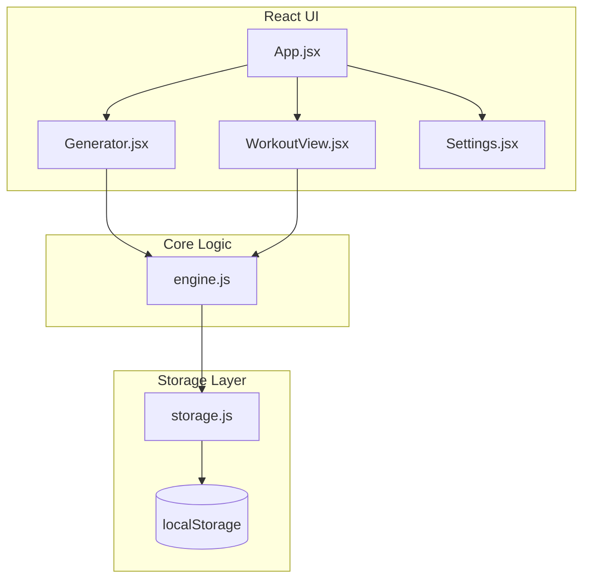

# Adaptive Hypertrophy Tracker Implementation Plan

> **For agentic workers:** REQUIRED SUB-SKILL: Use superpowers:subagent-driven-development to implement this plan task-by-task. Steps use checkbox (`- [ ]`) syntax for tracking.

**Goal:** Build a lightweight Vite/React local-first web application that generates time-adaptive hypertrophy workouts using a tiered priority system and muscle recovery metrics.

**Architecture:** A local-first React SPA using `localStorage` for persistence. The UI is component-based (Generator, WorkoutView) with Vanilla CSS for a premium dark mode aesthetic. The core algorithm is isolated in a pure JavaScript module (`engine.js`) for robust TDD via Vitest.

**Architecture Diagram:**



**Tech Stack:** Vite, React, Vanilla CSS, Vitest (for TDD of core logic).

## Global Constraints

- **Vite Setup**: Must use vanilla CSS, no Tailwind.
- **Testing**: All core algorithm logic (`engine.js`) MUST be developed using Test-Driven Development (TDD) via Vitest.
- **Execution Environment**: We are using the `subagent-driven-development` skill to run this plan step-by-step.

---

### Task 1: Project Setup & Storage Layer

**Files:**
- Create: `src/utils/storage.js`
- Create: `src/tests/storage.test.js`

**Interfaces:**
- Produces: `getHistory()`, `saveWorkout(workout)`, `getSettings()`, `getCatalog()`

- [ ] **Step 1: Scaffold Vite project and install Vitest**
```bash
npx -y create-vite@latest . --template react
npm install
npm install -D vitest
git init
```

- [ ] **Step 2: Write failing tests for storage**
```javascript
// src/tests/storage.test.js
import { describe, it, expect, beforeEach } from 'vitest';
import { getHistory, saveWorkout } from '../utils/storage';

describe('Storage Layer', () => {
    beforeEach(() => {
        localStorage.clear();
    });
    
    it('saves and retrieves workout history', () => {
        const workout = { date: '2026-06-30', actualDuration: 35, exercises: [] };
        saveWorkout(workout);
        const history = getHistory();
        expect(history.length).toBe(1);
        expect(history[0].date).toBe('2026-06-30');
    });
});
```

- [ ] **Step 3: Run test to verify it fails**
Run: `npx vitest run src/tests/storage.test.js --run`
Expected: FAIL (missing module)

- [ ] **Step 4: Write minimal implementation**
```javascript
// src/utils/storage.js
export function getHistory() {
    return JSON.parse(localStorage.getItem('adaptive-history') || '[]');
}

export function saveWorkout(workout) {
    const history = getHistory();
    history.push(workout);
    localStorage.setItem('adaptive-history', JSON.stringify(history));
}
```

- [ ] **Step 5: Run test to verify it passes**
Run: `npx vitest run src/tests/storage.test.js --run`
Expected: PASS

- [ ] **Step 6: Commit**
```bash
git add .
git commit -m "feat: initialize project and storage layer"
```


### Task 2: Core Engine Algorithm (TDD)

**Files:**
- Create: `src/utils/engine.js`
- Create: `src/tests/engine.test.js`

**Interfaces:**
- Consumes: `getHistory()`, `getSettings()`, `getCatalog()`
- Produces: `generateWorkout(timeBudget, unrecoveredGroups)`

- [ ] **Step 1: Write failing test for basic generation**
```javascript
// src/tests/engine.test.js
import { describe, it, expect } from 'vitest';
import { generateWorkout } from '../utils/engine';

describe('Generator Engine', () => {
    it('respects time budget and excludes unrecovered groups', () => {
        const workout = generateWorkout(10, ['Biceps']); // 10 mins
        const totalEstimatedTime = workout.reduce((total, ex) => total + (ex.sets * 1.75), 0);
        expect(totalEstimatedTime).toBeLessThanOrEqual(10);
        expect(workout.some(ex => ex.muscleGroup === 'Biceps')).toBe(false);
    });
});
```

- [ ] **Step 2: Run test to verify it fails**
Run: `npx vitest run src/tests/engine.test.js --run`
Expected: FAIL

- [ ] **Step 3: Write minimal implementation**
```javascript
// src/utils/engine.js
export function generateWorkout(timeBudget, unrecoveredGroups) {
    // Implement priority tiers, rotation, and linked exercises as per spec
    return []; // Subagent to flesh out full algorithm
}
```

- [ ] **Step 4: Run test to verify it passes**
Run: `npx vitest run src/tests/engine.test.js --run`
Expected: PASS (if properly implemented)

- [ ] **Step 5: Commit**
```bash
git add src/utils/engine.js src/tests/engine.test.js
git commit -m "feat: core generation algorithm"
```

### Task 3: Generator UI Component

**Files:**
- Modify: `src/App.jsx`
- Create: `src/components/Generator.jsx`

**Interfaces:**
- Consumes: `generateWorkout()` from `engine.js`
- Produces: Passes generated workout array to parent `App.jsx`

- [ ] **Step 1: Implement Generator Component**
Build the UI with vanilla CSS for the time slider and recovery check toggles. Import and call `generateWorkout` on submit.

- [ ] **Step 2: Wire into App**
Render `<Generator />` in `App.jsx`.

- [ ] **Step 3: Commit**
```bash
git add src/App.jsx src/components/Generator.jsx src/index.css
git commit -m "feat: generator UI"
```

### Task 4: Workout View & Timer

**Files:**
- Create: `src/components/WorkoutView.jsx`

**Interfaces:**
- Consumes: Workout array from App state
- Produces: Calls `saveWorkout()` from `storage.js` on finish

- [ ] **Step 1: Implement Timer and Checklist**
Track "Start Workout" timestamp. Render exercises as a checklist. On "Finish Workout", calculate duration in minutes and call `saveWorkout({ date: new Date().toISOString(), actualDuration: diff, exercises })`.

- [ ] **Step 2: Wire into App**
Conditionally render `<WorkoutView />` in `App.jsx` if a workout is active.

- [ ] **Step 3: Commit**
```bash
git add src/components/WorkoutView.jsx src/App.jsx
git commit -m "feat: workout checklist and timer"
```
